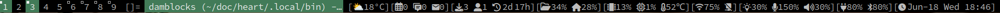

#  My build of [dam](https://codeberg.org/sewn/dam)

dam is a itsy-bitsy dwm-esque bar for [river].



For changes I've made, check [patches](./patches)

To use a status-bar, you can pass in status text via stdin:
```sh
# Start in river with damblocks, a line generator with signaling support I wrote
# https://codeberg.org/unixchad/damblocks
# https://github.com/gnuunixchad/damblocks
riverctl spawn "${HOME}/.local/bin/dam-run"
```
```sh dam-run
bar_start() {
    ${HOME}/.local/bin/damblocks | dam
}

bar_restart() {
    killall dam
    pkill -f damblocks
    bar_start
}

if ! pgrep 'dam' > /dev/null || ! pgrep -f 'damblocks' > /dev/null; then
    bar_restart
fi
```

## Building

To build dam first ensure that you have the following dependencies:

* wayland
* wayland-protocols
* fcft
* pixman
* pkg-config

Afterwards, run:
```
make
make install
```

## Usage

Run `dam`.

To hide the current selected output's monitor, the `USR1` signal can be
sent to do so.

[river]: https://codeberg.org/river
