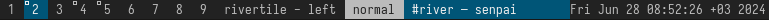

# dam

dam is a itsy-bitsy dwm-esque bar for [river].



To use a status-bar, you can pass in status text via stdin:
```
slstatus -s | dam
```

## Building

To build dam first ensure that you have the following dependencies:

* wayland
* wayland-protocols
* fcft
* pixman
* pkg-config

Afterwards, run:
```
zig build -Doptimize=ReleaseFast --prefix /usr/local install
```

## Usage

Run `dam`.

[river]: https://codeberg.org/river
